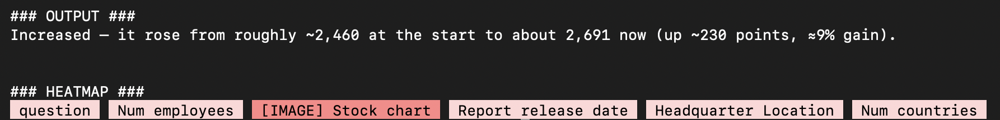

# XAI-Care — Explainable AI for Medical Diagnostics

XAI-Care is a Proof of Concept that wraps an LLM-based diagnostic assistant with [llmSHAP](https://github.com/filipnaudot/llmSHAP) to produce feature-level explanations of every AI diagnosis. Built for emergency department triage.

> **"The AI says cardiac infarction — but *why*?"**
> XAI-Care answers that question visually, in real time.

---

## The Problem

LLM-based diagnostic tools are increasingly used in clinical settings, but doctors face a fundamental trust barrier: the model says "cardiac arrest risk" with no explanation. Without transparency, physicians cannot validate, override, or learn from AI recommendations. This is the critical barrier to safe AI adoption in healthcare.

## The Solution

XAI-Care uses **Shapley values** (via `llmSHAP`) to measure each symptom's marginal contribution to the diagnosis. The result is a color-coded visualization showing exactly which features drove the AI's conclusion — and by how much.

| Without XAI | With XAI-Care |
|-------------|---------------|
| "Primary assessment: STEMI" | Same diagnosis **+** 🔴 *"radiating pain left arm"* 38%, 🔴 *"chest pressure"* 29%, 🔵 *"nausea"* 8% |

---

## Demo



---

## Quick Start

**1. Install dependencies**

```bash
pip install -e .
pip install -r requirements-app.txt
```

**2. Set your OpenAI API key**

```bash
cp .env.example .env
# Edit .env and add: OPENAI_API_KEY=sk-...
```

**3. Run the app**

```bash
streamlit run app.py
```

Open [http://localhost:8501](http://localhost:8501) in your browser.

---

## How It Works

```
Patient data + symptom text
         │
         ▼
  [LLM pre-processing]          ← GPT-4o-mini splits free text into
  age, sex, symptom_1, ...        structured sentence-valued features
         │
         ▼
  [llmSHAP attribution]         ← Shapley values: mask feature subsets,
  ShapleyAttribution(...)         compare outputs via embedding similarity
         │
         ▼
  Diagnosis + attribution dict  ← {symptom_1: {score: 0.42, value: "..."}, ...}
         │
         ▼
  [Streamlit UI]                ← Color-coded chips + Plotly bar chart
```

### Step-by-step

1. **Pre-processing** (`preprocess_input` in `app.py`): The symptom free-text is sent to an LLM which extracts distinct symptoms and contextual facts as individual sentence-valued keys. This gives llmSHAP meaningful, clinically interpretable units to attribute over.

2. **Shapley attribution** (`ShapleyAttribution` from llmSHAP): For each subset of features, the model is called with that subset masked. The output similarity (embedding cosine) is used as the value function. Shapley values distribute the "credit" for the final diagnosis across all features.

3. **Visualization** (`render_highlighted_text`, Plotly bar chart in `app.py`): Features are rendered as color-coded chips — red = pushes toward diagnosis, blue = suppresses. The percentage shown is the absolute Shapley value normalized to 100%.

---

## Code Structure

```
app.py                  ← Main Streamlit application (all UI + analysis logic)
requirements-app.txt    ← App-specific dependencies (streamlit, plotly, openai)
.env.example            ← Template for OPENAI_API_KEY
submission.md           ← Hackathon submission document

src/llmSHAP/            ← The llmSHAP library (attribution engine)
  attribution.py        ← ShapleyAttribution — main entry point
  data_handler.py       ← DataHandler — manages feature masking
  prompt_codec.py       ← BasicPromptCodec — formats features into prompts
  value_functions.py    ← EmbeddingCosineSimilarity, TF-IDF similarity
  attribution_methods/
    shapley_attribution.py  ← Core Shapley computation
    coalition_sampler.py    ← CounterfactualSampler and other strategies
  llm/
    openai.py           ← OpenAIInterface — wraps OpenAI chat completions
```

---

## Tech Stack

| Component | Technology |
|-----------|------------|
| XAI Engine | [llmSHAP](https://github.com/filipnaudot/llmSHAP) — Shapley attribution for LLMs |
| LLM | OpenAI GPT-4o-mini (PoC) / local model (production) |
| UI | [Streamlit](https://streamlit.io) |
| Visualization | [Plotly](https://plotly.com) |

---

## PoC → Production Path

| PoC (this demo) | Production |
|----------------|------------|
| OpenAI cloud API | Local LLM (Llama 3 / Mistral) on-premises |
| Manual symptom entry | Voice-to-text from clinical notes |
| Demo patient data | Real EHR integration (HL7 FHIR) |
| Embedding similarity | Fine-tuned clinical embeddings |

Running a local LLM means **no patient data leaves the hospital network** — satisfying GDPR, HIPAA, and the EU AI Act's requirements for high-risk AI systems.

---

## Why This Matters

- **Patient safety** — every AI decision carries a timestamped, auditable explanation.
- **Regulatory compliance** — EU AI Act and MDR require explainability for high-risk medical AI.
- **Clinician trust** — doctors adopt tools they can interrogate and override.
- **Error detection** — if the model over-weighted an ambiguous word, the attribution surfaces it immediately.

---

## License

MIT — see [LICENSE](LICENSE).
