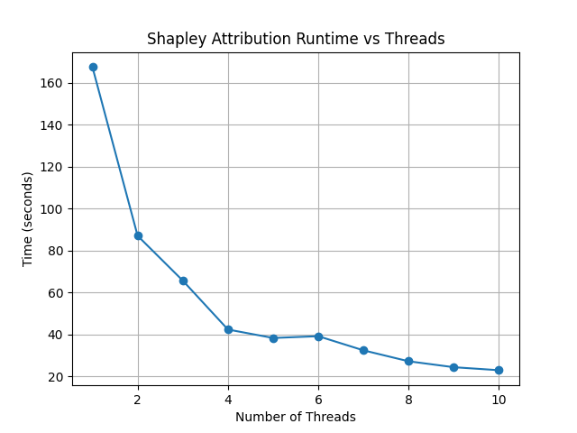

Tutorials
================================

Getting started
------------------------------------
First, install ``llmSHAP`` with the recommended extras:

.. tab-set::

   .. tab-item:: pip

      .. code-block:: bash

         pip install "llmshap[all]"

   .. tab-item:: clone

      .. code-block:: bash

         pip install -e ".[all]"

Next, create a ``.env`` file in the root directory to store your API keys:

.. code-block:: python

   # Used for the OpenAIInterface.
   OPENAI_API_KEY = <your_api_key_here>

llmSHAP - Usage
------------------------------------
There are 4 main components to the library: ``DataHandler``, ``PromptCodec``, ``LLMInterface``, and ``AttributionFunction``.

- ``DataHandler``: Handles the data. This class can get subsets of the data and convert the desired data into a format that is suitable for a large language model (LLM).
- ``PromptCodec``: Turns a data selection into a prompt and parses the model's reply.
- ``LLMInterface``: The model backend (OpenAI, Mistral, local, etc.).
- ``AttributionFunction``: Computes the attribution scores for each chunk.

Let's now walk through a small example. We'll use a string (token-level features) and keep a few uninteresting tokens permanently included.

We start by importing the relevant classes:

.. code-block:: python

   from llmSHAP import DataHandler, BasicPromptCodec, ShapleyAttribution
   from llmSHAP.llm import OpenAIInterface

We can now create the data, which is a simple string, and instantiate our data handler. 
We select the indices of the tokens/words "In", "is", and "the" as permanent keys, since these tokens would 
increase computation time while likely providing little useful insight.

.. code-block:: python

   data = "In what city is the Eiffel Tower?"
   handler = DataHandler(data, permanent_keys={0,3,4})

The ``DataHandler`` will split this string on spaces and create a Python dict with the word indices as keys.

We need a ``PromptCodec`` to interact with the LLM and for this example we will use the ``llmSHAP.BasicPromptCodec`` prompt codec.

.. code-block:: python

   prompt_codec = BasicPromptCodec(system="Answer the question briefly.")

Finally, we create the LLM interface, which will allow us to interact with an LLM (local or API-based).

.. code-block:: python

   llm = OpenAIInterface(model_name="gpt-4o-mini")

We are now ready to compute the attribution score for each token in the string (except for "In", "is", and "the" since they are **permanent**).

.. code-block:: python
   
   shap = ShapleyAttribution(model=llm, data_handler=handler, prompt_codec=prompt_codec, use_cache=True)
   result = shap.attribution()

The full code should now look like this:

.. code-block:: python

   from llmSHAP import DataHandler, BasicPromptCodec, ShapleyAttribution
   from llmSHAP.llm import OpenAIInterface

   data = "In what city is the Eiffel Tower?"
   handler = DataHandler(data, permanent_keys={0,3,4})
   prompt_codec = BasicPromptCodec(system="Answer the question briefly.")
   llm = OpenAIInterface(model_name="gpt-4o-mini")

   shap = ShapleyAttribution(model=llm, data_handler=handler, prompt_codec=prompt_codec, use_cache=True)
   result = shap.attribution()

   # We can now print the results.
   print("\n\n### OUTPUT ###")
   print(result.output) # The LLM's answer to the question.

   print("\n\n### ATTRIBUTION ###")
   print(result.attribution) # The attribution score mapping.

Threads
------------------------------------
``llmSHAP`` also supports multi-threading, via the ``num_threads`` parameter in ``ShapleyAttribution``. 
This assumes that the LLM inference backend can 
handle multiple concurrent inference requests, since the parallelization happens at the 
inference call level. 

The example below runs Shapley attribution on a 7-feature input string with
1-10 threads and measures the runtime (requires ``pip install matplotlib``).

.. code-block:: python

   import time
   import matplotlib.pyplot as plt
   from llmSHAP import DataHandler, BasicPromptCodec, ShapleyAttribution
   from llmSHAP.llm import OpenAIInterface

   data = "In what city is the Eiffel Tower?"
   handler = DataHandler(data, permanent_keys=None)
   prompt_codec = BasicPromptCodec(system="Answer the question briefly.")
   llm = OpenAIInterface(model_name="gpt-4o-mini")

   times = []
   threads = list(range(1, 11))
   for num_threads in threads:
      shap = ShapleyAttribution(model=llm,
                                 data_handler=handler,
                                 prompt_codec=prompt_codec,
                                 use_cache=True,
                                 num_threads=num_threads)
      start = time.time()
      _ = shap.attribution()
      times.append(time.time() - start)

   plt.plot(threads, times, marker="o")
   plt.xlabel("Number of Threads")
   plt.ylabel("Time (seconds)")
   plt.title("Shapley Attribution Runtime vs Threads")
   plt.grid(True)
   plt.show()

DataHandler
------------------------------------
A quick, practical guide to using ``llmSHAP.DataHandler`` for chunk-level attribution and perturbations.

Why it matters (chunk-level control)
^^^^^^^^^^^^^^^^^^^^^^^^^^^^^^^^^^^^^

Unlike token-only approaches (e.g., word-level masking), ``DataHandler`` lets you choose your *feature granularity*: 
words, sentences, paragraphs, or any fields you define. Pass a string for word-like tokens, or a mapping for sentence/section chunks.
This enables meaningful ablations (e.g., remove one sentence while keeping the rest).

1) Create a DataHandler from strings and dicts
^^^^^^^^^^^^^^^^^^^^^^^^^^^^^^^^^^^^^^^^^^^^^^^

String input (auto-splits on spaces into tokens)::

   from llmSHAP import DataHandler

   text = "The quick brown fox jumps over the lazy dog"
   dh = DataHandler(text)  # keys become 0..N-1 (indexes of tokens)

Dict input (you control the chunks and their order)::

   from llmSHAP import DataHandler

   data = {
      "s1": "Paris is the capital of France.",
      "s2": "The Eiffel Tower is in Paris.",
      "s3": "It was completed in 1889."
   }
   dh = DataHandler(data)

.. tip:: dict input is best when you want chunk-level attributions (sentences, paragraphs, fields). String input is fine for word/token-level.

2) Inspect features (indexes and keys)
^^^^^^^^^^^^^^^^^^^^^^^^^^^^^^^^^^^^^^^^^^^^^^^^^^^^^^^^^^^^^^^^^^^^^^^^^^^^^^^^^^^^^^^^

To retrieve the data, there are two main functions: ``get_data`` and ``get_keys``.

::
   
   from llmSHAP import DataHandler

   data = {
      "s1": "Paris is the capital of France.",
      "s2": "The Eiffel Tower is in Paris.",
      "s3": "It was completed in 1889."
   }

   dh = DataHandler(data, permanent_keys={"s1"})

   all_keys = dh.get_keys() # Returns the enumerated keys
   print(all_keys) # Result: [0, 1, 2]

   # Returns the non-permanent enumerated keys
   non_perm_keys = dh.get_keys(exclude_permanent_keys=True)
   print(non_perm_keys) # Result: [1, 2]

   # Returns all the data
   all_data = dh.get_data(dh.get_keys())
   print(all_data)
   # Result: {'s1': 'Paris is the capital of France.', 's2': 'The Eiffel Tower is in Paris.', 's3': 'It was completed in 1889.'}

   # Returns the data at the specified indices
   data = dh.get_data({1})
   print(data)
   # Result: {'s1': 'Paris is the capital of France.', 's2': 'The Eiffel Tower is in Paris.', 's3': ''}

   # s1 is permanent and {1,2} are the indices of s2 and s3
   data_no_mask = dh.get_data({1,2}, mask=False)
   print(data_no_mask)
   # Result: {'s1': 'Paris is the capital of France.', 's2': 'The Eiffel Tower is in Paris.', 's3': 'It was completed in 1889.'}

   data_no_perm = dh.get_data({1}, mask=True, exclude_permanent_keys=True)
   print(data_no_perm)
   # Result: {'s1': '', 's2': 'The Eiffel Tower is in Paris.', 's3': ''}

Retrieve the index → key mapping using ``get_feature_enumeration``.

::

   index_feature_mapping = dh.get_feature_enumeration()
   print(index_feature_mapping)
   # Result: {0: 's1', 1: 's2', 2: 's3'}

3) Permanent keys (always-included context)
^^^^^^^^^^^^^^^^^^^^^^^^^^^^^^^^^^^^^^^^^^^

.. important::
   permanent_keys must match the actual keys in the internal mapping.
   
   If you passed a dict, use the dict keys (e.g. "sentence_1", "sentence_2").
   
   If you passed a string, keys are token indexes (0..N-1), so use integers (e.g. {0, 3}).

Dict input → use dict keys
""""""""""""""""""""""""""""
``permanent_keys`` pins features that must always be present (e.g., instructions, the actual question). 
They are **auto-included** unless you explicitly exclude them::

   from llmSHAP import DataHandler

   data = {
      "(0) instruction": "Answer briefly.",
      "(1) question": "In what city is the Eiffel Tower?",
      "(2) hint": "Think about landmarks in France.",
      "(3) distractor": "Cats are mammals."
   }
   dh = DataHandler(data, permanent_keys={"(0) instruction", "(1) question"})

   # When requesting a subset, permanent ones stay:
   print(dh.get_data(2, mask=False))
   # Result: {'(0) instruction': 'Answer briefly.', '(1) question': 'In what city is the Eiffel Tower?', '(2) hint': 'Think about landmarks in France.'}

   # Only the variable chunk (no pinned context):
   print(dh.get_data(2, mask=False, exclude_permanent_keys=True))
   # Result: {'(2) hint': 'Think about landmarks in France.'}

String input → use token indexes
""""""""""""""""""""""""""""""""""

::

   dh = DataHandler("The Eiffel Tower is in Paris", permanent_keys={0, 5})
   print(dh.get_data(2, mask=False)) # includes tokens at indexes 0 and 5 automatically

When to use permanent keys:

- Keep system/instruction text constant while perturbing evidence chunks.

- Keep the question fixed while Shapley samples supporting sentences.

- Ensure formatting/scaffolding remains valid across perturbations.

4) Perturb the data (mask vs remove) and build strings
^^^^^^^^^^^^^^^^^^^^^^^^^^^^^^^^^^^^^^^^^^^^^^^^^^^^^^^^

Select specific indexes (e.g., 1, 2, 3) and get a *masked* view (default ``mask_token`` is ``""``)::

   from llmSHAP import DataHandler
   
   data = {
      "s1": "Paris is the capital of France.",
      "s2": "The Eiffel Tower is in Paris.",
      "s3": "It was completed in 1889."
   }
   dh = DataHandler(data)

   view = dh.get_data({1, 2}, mask=True)
   print(view)  # selected indexes show original text and others are mask_token
   # Result: {'s1': '', 's2': 'The Eiffel Tower is in Paris.', 's3': 'It was completed in 1889.'}

Get only the selected features as a smaller dict (no masking)::

   subset = dh.get_data({1, 2}, mask=False)
   print(subset)
   # Result: {'s2': 'The Eiffel Tower is in Paris.', 's3': 'It was completed in 1889.'}

Turn a selection into a single prompt string::

   prompt_str = dh.to_string({1,2}, mask=True)
   print(prompt_str)
   # Result: The Eiffel Tower is in Paris. It was completed in 1889.

Use a visible mask token if you prefer::

   dh = DataHandler(data, mask_token="[MASK]")
   print(dh.to_string({1, 2}, mask=True))
   # Result: [MASK] The Eiffel Tower is in Paris. It was completed in 1889.

Non-destructive removal (returns a *copy*, original ``dh`` unchanged)::

   copy_removed = dh.remove({1}, mask=False)

Destructive removal (updates the handler and re-enumerates indexes)::

   dh.remove_hard({1})

5) Minimal end-to-end example
^^^^^^^^^^^^^^^^^^^^^^^^^^^^^^^

Combine everything into a small workflow::

   from llmSHAP import DataHandler

   data = {
      "system": "Answer concisely.",
      "s1": "Paris is the capital of France.",
      "s2": "The Eiffel Tower is in Paris.",
      "s3": "It was completed in 1889."
   }
   dh = DataHandler(data, permanent_keys={"system"})

   # Full prompt string (all chunks)
   base_prompt = dh.to_string(dh.get_keys(), mask=True)

   # Ablate s2 (keep s1 and s3). "system" is auto-included
   keep_idxs = { dh.get_keys()[1], dh.get_keys()[3] } # Using get_keys as example instead of get_data
   ablate_s2_prompt = dh.to_string(keep_idxs, mask=True)

   # Variable-only dict (no permanent context)
   exclude_permanent = dh.get_data({1, 3}, mask=False, exclude_permanent_keys=True)

   print(f"Base: {base_prompt}")
   print(f"Ablate s2 prompt: {ablate_s2_prompt}")
   print(f"Exclude permanent: {exclude_permanent}")
   # Result:
   # Base: Answer concisely. Paris is the capital of France. The Eiffel Tower is in Paris. It was completed in 1889.
   # Ablate s2 prompt: Answer concisely. Paris is the capital of France.  It was completed in 1889.
   # Exclude permanent: {'s1': 'Paris is the capital of France.', 's3': 'It was completed in 1889.'}

DataHandler cheat sheet
^^^^^^^^^^^^^^^^^^^^^^^^

- ``DataHandler(string)`` → word/token features
- ``DataHandler(dict)`` → chunk features you define (sentences/sections/fields)
- ``get_feature_enumeration()`` → index→key map
- ``get_keys(exclude_permanent_keys=...)`` → iterable indexes for sampling
- ``get_data(indexes, mask=True/False, exclude_permanent_keys=...)`` → dict view
- ``to_string(indexes, mask=...)`` → prompt-ready string
- ``remove(indexes, mask=...)`` → non-destructive copy
- ``remove_hard(indexes)`` → destructive, re-enumerates
- ``permanent_keys={...}`` → always-include context
- ``mask_token="[MASK]"`` → visible masking in prompts
